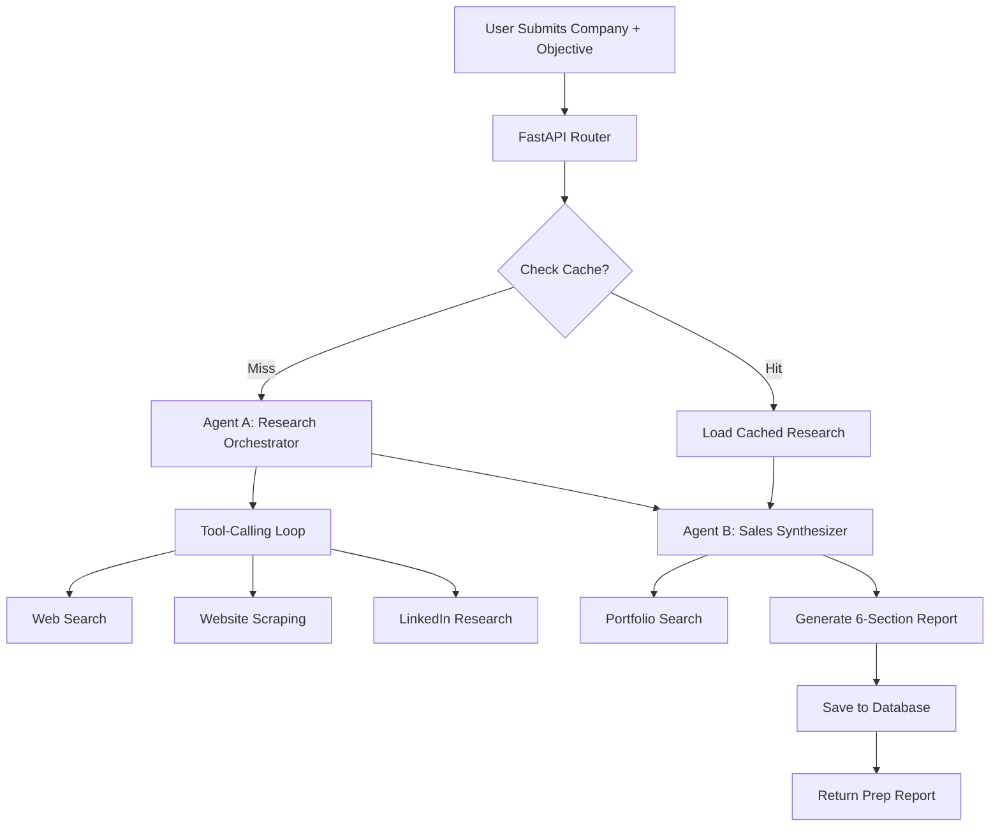
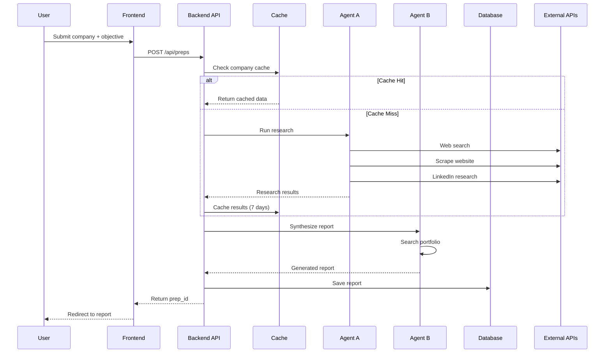
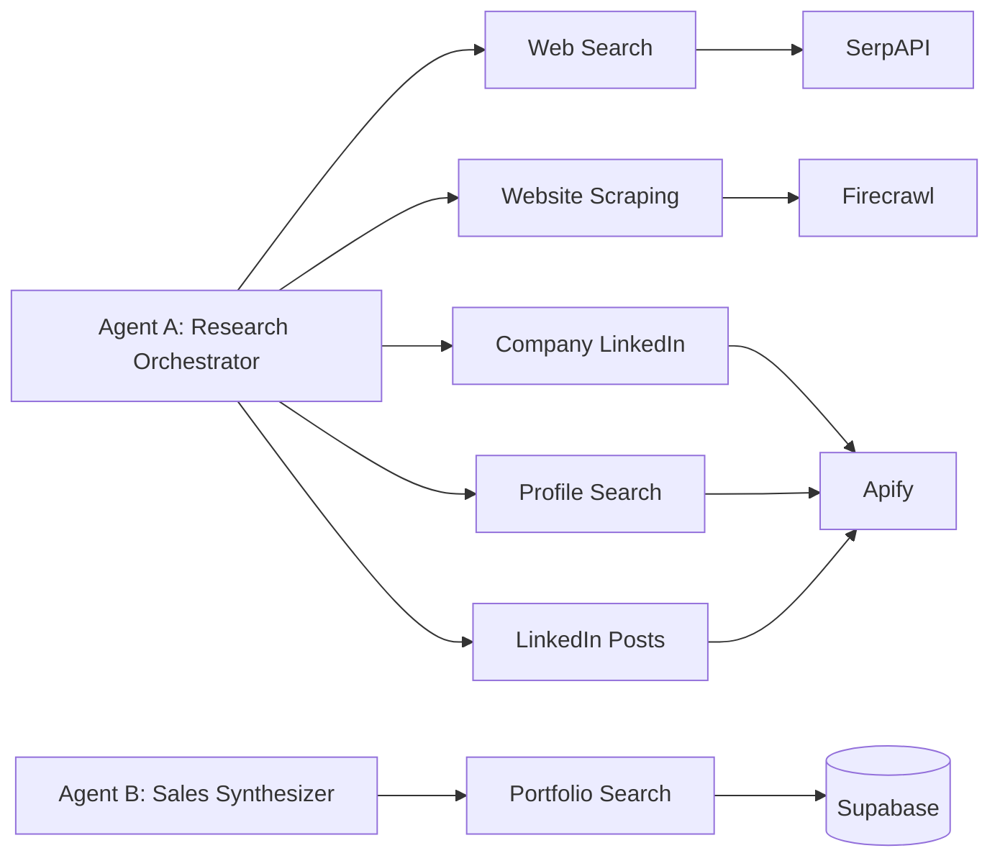

# Sales Call Prep Assistant

<div align="center">

**AI-Powered Sales Preparation in Minutes, Not Hours**

[](https://fastapi.tiangolo.com/)
[](https://nextjs.org/)
[](https://www.python.org/)
[](https://www.typescriptlang.org/)
[](https://supabase.com/)

</div>

## 🎯 Overview

The Sales Call Prep Assistant is an AI-powered tool that helps  professionals (freelancers, consultants, and SDRs) prepare for sales calls in minutes instead of hours. It automatically researches prospects and generates personalized talking points using a sophisticated two-agent system with tool-calling architecture.

**What it does:**
- Automatically researches prospect companies and decision makers
- Generates comprehensive 6-section sales prep reports with confidence scoring
- Smart caching system (7-day TTL) reduces API costs and improves performance
- Exports to PDF and Markdown formats
- Provides dashboard with meeting history and outcome tracking

**What makes it special:**
- 🤖 **Two-Agent AI System**: Research orchestrator + sales synthesizer working in tandem
- 🧠 **Intelligent Tool Usage**: Agents autonomously decide which tools to use and when
- 📊 **Confidence Scoring**: Every section rated 0.0-1.0 based on data quality
- 💰 **Cost-Effective**: 7-day caching to reduce API costs

## ✨ Features

### Core Functionality
- **Automated Research**: Web search, website scraping, LinkedIn data extraction
- **AI Report Generation**: 6-section comprehensive sales prep with confidence scores
- **Smart Caching**: 7-day TTL reduces redundant API calls
- **Portfolio Matching**: Finds relevant user projects for each prospect
- **Confidence Scoring**: Transparent data quality metrics

## 🏗️ Architecture

### System Overview

The system follows a **two-agent architecture** with specialized roles:



### Two-Agent System Deep Dive

**Agent A - Research Orchestrator**
- Uses Pydantic AI with Gemini 2.5 flash model
- 5 available tools for data gathering
- Makes iterative tool calls based on learned information
- Returns structured research data with confidence scores
- Implements 7-day caching system

**Agent B - Sales Brief Synthesizer**
- Uses Pydantic AI with Gemini 2.5 flash model
- 1 tool: searches user's portfolio for relevant projects
- Receives research data + user profile + meeting objective
- Generates structured 6-section prep reports
- References specific portfolio projects throughout

### Data Flow



### Tool Architecture

Each agent has access to specialized tools:



## 🛠️ Tech Stack

### Frontend
- **Framework**: Next.js 14 (App Router)
- **Language**: TypeScript
- **Styling**: Tailwind CSS
- **UI Components**: shadcn/ui
- **State Management**: React Context (Auth)
- **Authentication**: Supabase Auth

### Backend
- **Framework**: FastAPI (Python 3.11+)
- **AI**: Google Gemini (via Pydantic AI)
- **Database**: Supabase (PostgreSQL)
- **Authentication**: Supabase Auth with JWT
- **Caching**: PostgreSQL with TTL

### External Services
- **Web Search**: SerpAPI
- **Website Scraping**: Firecrawl
- **LinkedIn Data**: Apify
- **LLM**: Google Gemini

### Development Tools
- **Package Manager**: uv (Python), pnpm (Node.js)
- **Testing**: pytest (Python), Jest (Frontend)
- **AI Code Review**: CodeRabbit

## 📁 Project Structure

```
sales-call-prep-assistant/
├── backend/                    # FastAPI Python backend
│   ├── src/
│   │   ├── main.py            # FastAPI app entry point
│   │   ├── config.py          # Environment configuration
│   │   ├── dependencies.py    # Auth & Supabase dependencies
│   │   ├── routers/           # API route handlers
│   │   │   ├── prep.py        # Prep creation/retrieval routes
│   │   │   └── profile.py     # User profile CRUD operations
│   │   ├── agents/            # Two-agent system
│   │   │   ├── research_orchestrator/
│   │   │   │   ├── agent.py   # Agent A implementation
│   │   │   │   └── tools/     # 5 research tools
│   │   │   └── sales_synthesizer/
│   │   │       ├── agent.py   # Agent B implementation
│   │   │       └── tools/     # Portfolio search tool
│   │   ├── services/          # External API wrappers
│   │   │   ├── apify_service.py
│   │   │   ├── firecrawl_service.py
│   │   │   ├── search_service.py
│   │   │   ├── cache_service.py
│   │   │   └── supabase_service.py
│   │   ├── schemas/           # Pydantic models
│   │   │   ├── prep_report.py
│   │   │   └── user_profile.py
│   │   └── utils/
│   │       └── logger.py
│   └── supabase/
│       ├── migrations/        # Database migrations
│       └── config.toml
├── frontend/                  # Next.js TypeScript frontend
│   ├── src/
│   │   ├── app/              # Next.js App Router
│   │   │   ├── page.tsx      # Landing page
│   │   │   ├── login/        # Auth pages
│   │   │   ├── signup/
│   │   │   ├── profile/      # Profile management
│   │   │   ├── new-prep/     # Create prep form
│   │   │   └── prep/[id]/    # View prep report
│   │   ├── components/       # Reusable components
│   │   │   ├── ui/          # shadcn/ui components
│   │   │   └── providers/   # Context providers
│   │   └── lib/             # Utilities
│   │       ├── supabase/    # Supabase client
│   │       └── utils.ts
└── docs/                     # Project documentation
    ├── PRD.md              # Product requirements
    ├── GEMINI.md            # AI prompting guide
    ├── ERROR_HANDLING.md    # Error handling guide
    └── CodeRabbit-*.md      # Code review docs
```

## 🚀 Getting Started

### Prerequisites

- **Python 3.11+** with `uv` package manager
- **Node.js 18+** with `pnpm`
- **Supabase account** (free tier works)
- **API Keys**:
  - Google Gemini API key
  - SerpAPI key
  - Firecrawl API key
  - Apify API key

### 1. Clone the Repository

```bash
git clone https://github.com/lessan-cyber/Sales-call-prep-assistant.git
cd sales-call-prep-assistant
```

### 2. Backend Setup

```bash
cd backend

# Create virtual environment and install dependencies
uv sync

# Copy environment template
cp .env.example .env

# Edit .env with your API keys
nano .env
```

**Required environment variables:**
```bash
# Supabase
SUPABASE_URL=your-supabase-project-url
PUSHABLE_KEY=your-supabase-anon-key
SECRET_KEY=your-supabase-service-role-key

# AI & Search
GOOGLE_API_KEY=your-google-api-key
SERP_API_KEY=your-serpapi-key
FIRECRAWL_API_KEY=your-firecrawl-key
APIFY_API_KEY=your-apify-key
GEMINI_MODEL=gemini-2.5-pro

# Start development server
uvicorn src.main:app --reload --host 0.0.0.0 --port 8000
```

The API will be available at `http://localhost:8000`
API documentation at `http://localhost:8000/docs`

### 3. Frontend Setup

```bash
cd frontend

# Install dependencies
pnpm install

# Create environment file
cp .env.example .env.local

# Edit .env.local with your Supabase credentials
nano .env.local
```

**Required environment variables:**
```bash
NEXT_PUBLIC_SUPABASE_URL=your-supabase-project-url
NEXT_PUBLIC_SUPABASE_ANON_KEY=your-supabase-anon-key
NEXT_PUBLIC_BACKEND_API_URL=http://localhost:8000

# Start development server
pnpm dev
```

The app will be available at `http://localhost:3000`

### 4. Database Setup

```bash
# From backend directory
cd backend

# Start Supabase (if using local instance)
supabase start

# Or apply migrations to hosted instance
supabase db push

# View database
supabase studio
```

### 5. Test the System

1. Open `http://localhost:3000`
2. Sign up for an account
3. Complete your profile (minimum 5 portfolio projects)
4. Create a new prep report
5. View the generated report with confidence scores

## 🔍 How the Agents Work

### Agent A: Research Orchestrator

**Purpose**: Intelligently gather prospect intelligence using available tools.

**Strategy**:
1. Start with web search to find official website
2. Scrape website for detailed company information
3. Use LinkedIn tools for company/decision maker data
4. Make iterative tool calls based on what was learned
5. Continue until sufficient data gathered (target: >0.7 confidence)

**Tools Available**:
- `web_search`: Search for company info, news, LinkedIn profiles
- `scrape_website`: Get detailed company info from their site
- `get_company_linkedin`: Company size, industry, recent posts
- `search_linkedin_profile`: Find specific person's profile
- `scrape_linkedin_posts`: Recent company activity

**Decision Logic**:
- If web search fails → Try alternative queries
- If scraping fails → Note limitation, continue with available data
- If LinkedIn unavailable → Focus on web search and website
- Stop when enough data for sales prep (>0.7 confidence)

**Output**: Structured research data with:
- Company intelligence (industry, size, description, news, initiatives)
- Decision makers (names, titles, backgrounds, LinkedIn URLs)
- Research limitations (what data was missing)
- Confidence scores
- Sources used

### Agent B: Sales Brief Synthesizer

**Purpose**: Transform research data into actionable sales preparation.

**Strategy**:
1. Analyze prospect's challenges from research
2. Search user's portfolio for relevant case studies
3. Connect portfolio projects to prospect pain points
4. Generate 6-section report with specific talking points
5. Reference exact portfolio projects throughout

**Tools Available**:
- `search_portfolio`: Find relevant user projects based on prospect context

**Output**: Complete PrepReport with:
1. **Executive Summary** (TL;DR version)
2. **Strategic Narrative** (dream outcome, proof, pain points)
3. **Talking Points & Pitch Angles** (opening hook, key messages)
4. **Questions to Ask** (strategic, technical, business impact)
5. **Key Decision Makers** (profiles, backgrounds)
6. **Company Intelligence** (industry, size, news, initiatives)


## 🔐 Security

### Authentication & Authorization

- **Supabase Auth**: JWT-based authentication
- **Row-Level Security (RLS)**: Database-level access control
- **User Isolation**: Users can only access their own data
- **Secure Headers**: CORS, CSRF protection
